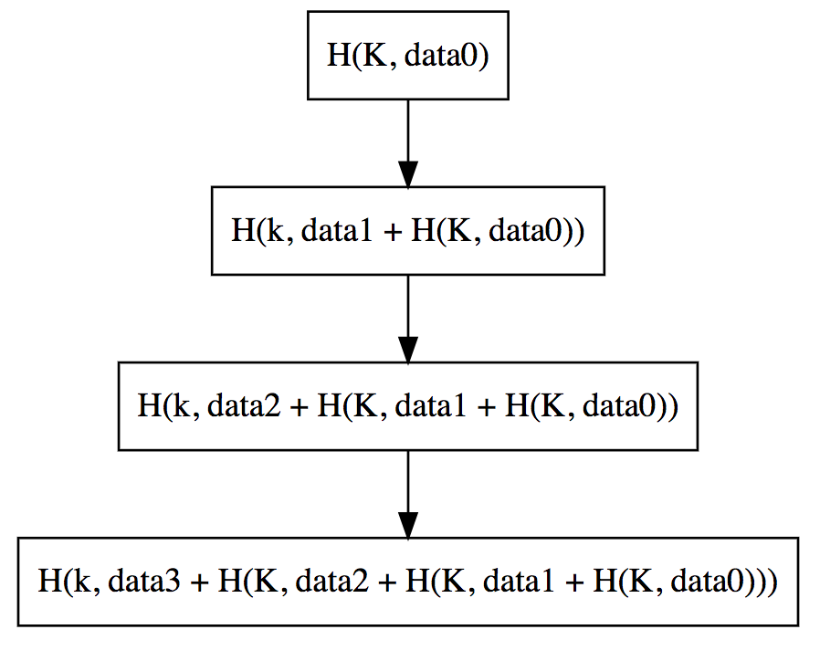
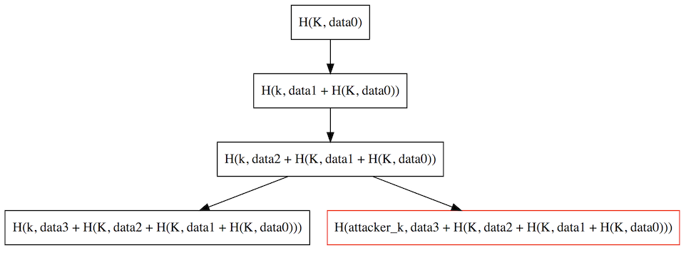
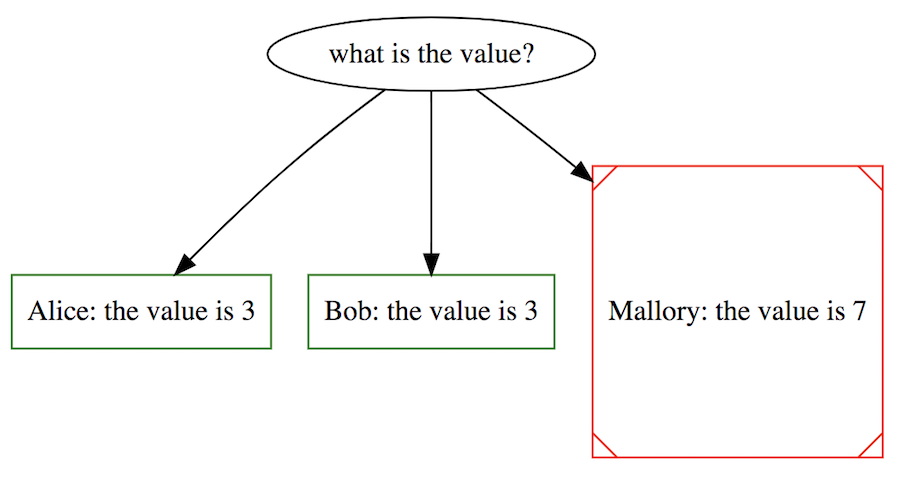
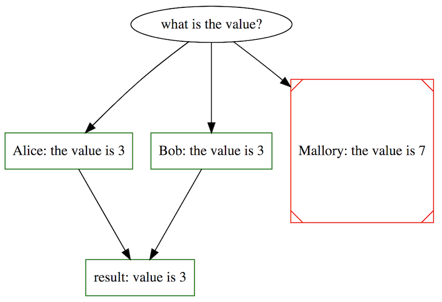
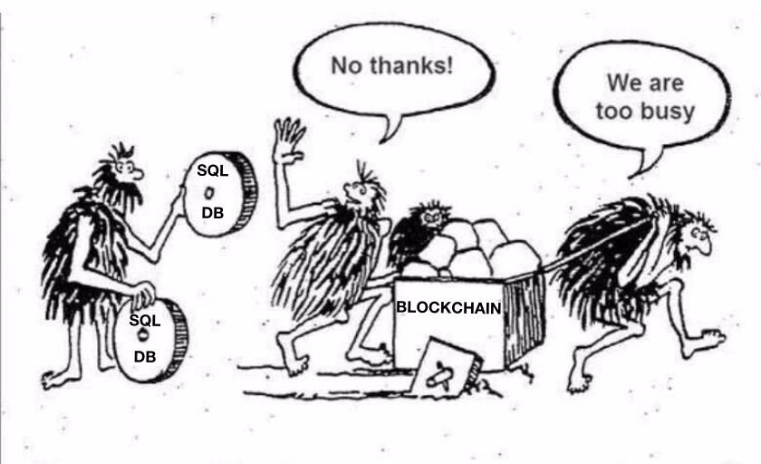
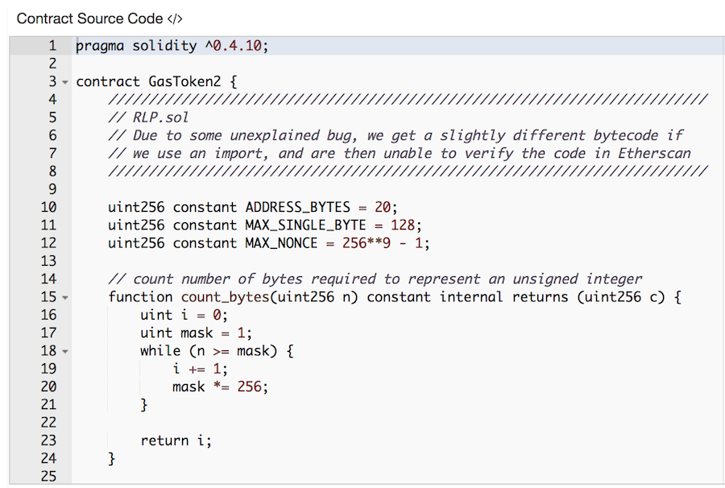

# The lojikil center for kids who don't blockchain good and want to learn how to do other things good too

## stefan edwards, blockchain nihilist 

<!--
footer: Stefan Edwards//Trail of Bits//@lojikil//@trailofbits
page_number:true
-->

---

# overview

_a long walk off the short pier of blockchain_

- this slide
- background on me
- background on ToB
- what are blockchains
- simple testing: languages & environments
- actually testing

---

## `$ finger stefan.edwards@trailofbits.com`

```
[trailofbits]
Stefan Edwards (lojikil) is not presently logged in.

Senior Security Consultant @trailofbits
Twitter/Github/Lobste.rs: lojikil
Works in: Blockchain, IoT, compilers, vCISO
Previous: net, web, adversary sim, &c. 
Infosec philosopher, amateur^wprofessional programming 
language theorist, everyday agronomer, father (doge, 
human), future-husband.

WARNING: DEAF
WARNING: Noo Yawk
```

---

## `$ whois trailofbits.com`

```
% whois trailofbits.com
organization: Trail of Bits
founded: 2012
size: 50
purpose: cybersec r&d
focus: security research, development, and assessments
focus: correctness & security
verticals: finance (fintech/finsrv), tech, gov
```

---

## what is this talk?


---

# what *are* blockchains?

_besides just a fancy ledger_

**three things**:

1. a collection of data
2. stored in an authenticated datastructure
3. with some sort of consensus protocol

---

# what are blockchains: simple example

## let's design a system...

- easy to prove I authored something 
- easy to prove that data hasn't been tampered with
- difficult to forge 

---

# what are blockchains: simple example

## what we need is...

- Some function `H`
- Some key `K`
- a calculated result: `H(K, data) == some unique value`
- Blockchains: repeated applications of `H` over new data
- including previous data

---



---

# please calculate...

## `H(K, "why do I care")`

---

# why do I care? 



- can easily verify that a block with key `attacker_k` is invalid
- additionally, I cannot later modify `data1`

---

# ... isn't that obvious?

<!-- you may be thinking... -->

- Merkle Trees (1979)
- Linked Time Stamps (1992)
- Direct Acyclical Graphs (< 1960's)

---

# where this becomes cool...

_for some value of the word "cool"_

**Consensus**
_con-sen-sus_
> general agreement (Merriam Webster)

**or**

> probably a vulnerability (me, looking at most consensus protocols)

---

# consensus

- easy to get wrong 
- a common algorithm (BFT) even has the word "Byzantine" in it
- effectively a giant statemachine 
- many different styles (PoW, PoA, PoS, DPoS...)
- but basically: we all calculate the same thing and present a value
- if the _majority_ of us agree on that value, then it's the value

---



---



---

# so why?



---

# so why?

- most miss the mark
- Good: counter party risk, "nothing up my sleeve," CAP, money
- Bad: speed, general purpose, environment (electricity usage vs PoW)
- just a giant ledger

---

# take aways:

- blockchains aren't new
- just combining multiple old things
  - authenticated data structures
  - hashing
  - consensus protocols
- really just a giant ledger 

---

# what is new?

## traditional protections are *dead*

| Property | Traditional | Blockchain |
| :-: | :-: | :-: |
| Code Visbility | (Web) API | Fully binary to everyone |
| AuthZ/AuthN | Session Management, WAF, SSO | lol |
| Channel Privacy | TLS | lol |
| Updates | Deploy a patch | lol |

---

# simple testing

## let's look at testing Ethereum

- pretty common (~ 80% of my assessments)
- pretty terrible
- most common "dapp" target

---

# simple testing :: pretty terrible 

- EVM: stack machine with terrible numerics
- Most common language? Solidity
  - Solidity takes worst of C + worst of JS
- Terrible ERCs/EIPs
- Written by "enthusiasts" 
- Everything is exposed
  - due to the nature of blockchain 
  - leads to: hostile environment
- Effectively a target-rich environment 

---

# simple testing :: common issues

1. Terrible Mathematics
2. Access Control
3. No Secrecy
4. Terrible Specifications
5. TOCTOU/Re-entrancy

---

# simple testing :: math

- by default, 256bit integers
  - yes, **256** bit
- Terrible decisions by the compiler
- Leads to interesting problems

---

# simple testing :: math

```JS
uint i = 1;
var j = 2;
var k = i - j;
```

- JavaScript: `i` and `j` are integers, `1 - 2` is `-1`
- Solidity: `k` is `115792089237316195423570985008687907853269984665640564039457584007913129639935`

---

# simple testing :: math

- pitched as "JavaScript-like"
  - it's not
- has nuances in semantics like C
- None of the benefits of either 

---

# simple testing :: math :: real world

- why do we care?

```JS
function withdraw(uint amount) {
    require(balances[msg.sender] - amount > 0);
    // ...
}
```

- amount is `uint`, cannot be < 0 ever	

---

# simple testing :: math :: real world

```JS
uint i = 0xdeadbeef;
for(var j = 0; j < i; j++) {
    // ...
}
```
- `j` is typed as `uint8` 
- max value of `uint8` is `255`
- 255 is **always** less than `0xdeadbeef` 
- loop exhaustion

---

# simple testing :: math :: take aways

- manually size your variables
- never rely on Solidity to do the right thing (it won't)
- always verify your execution semantics and `require` statements
  - esp when variables of different sizes are in play 

---

# simple testing :: access control

<!-- 
introduce concepts.
-->

- Addresses (users, wallets, contracts)
- Transactions (function calls, sending money, deploying code...)
- uses public key encryption throughout

<!-- draw it out here... -->

---

# simple testing :: access control

- by default, everything is public 
- anyone on the blockchain can call/view `public` functions/data

```JS
function sensitive_func(...) {
    // defaults to public
    // anyone can call this 
}
```

- Multiple flaws (Parity several times, Ruibixi...)
- Thousands/millions of $ in ETH
- fix? `... sensitive_func(...) private {`

---

# simple testing :: access control

- like web apps, admin functionality
- more complex than `public`/`private` dichotomy 
  - admin **must** remotely call something? `public`
- fix? ownership check

---

# simple testing :: access control

```JS
contract Foo {
    address owner;
    
    modifier isOwner() { 
      require(msg.sender == owner); 
      _; 
    }
    // ...
    function sensitive_function() public isOwner {
       // ...
    }
    
    function another_sensitive_function() public {
       // ... whoops ... 
    }
}
```

---

# simple testing :: AC :: take aways

- review contracts for public/private
- understand when things should be public, but restricted
- ensure that you actually have methods of setting `owner` _sighs_

---

# simple testing :: secrecy

- blockchain is meant to be public
- even `private` in Solidity isn't _secret_
- again... literally meant to be **public**
- sites like etherscan exist for exploration
- unconfirmed blocks are public 

---

<!-- this is a random contract we were discussing at work... -->



---

# simple testing :: secrecy

- unconfirmed blocks are public
- you can see these blocks, including data
- multiple methods of front running, theft, &c. 
- takeaway? treat the blockchain as public, nothing is secret 

---

# simple testing :: terrible specifications

- Etheum Request (for) Comments or Ethereum Impl Proposal
- poorly specified
  -  seriously, uses words like "could"
- written by "enthusiasts"
  - little understanding of impact
- let's pick on one: ERC20 Token Standard

---

# simple testing :: terrible specifications

- ERC20 defines simple token interace
  - tokens are a type of fungible asset
- fairly simple (`transfer`, `approve`, &c.)
- **no** formal specification
- **no** formal test suite
- **at least** 710 on the market
  - largest market cap: 5.02b USD   

---

# simple testing :: terrible specifications

- simple interface => complex problems
- codifies a front running attack
- codifies a TOCTOU attack (next section)
- **Per the spec** you can't fix anything 
- takeaway? soooo... good luck with guidance 

---

# simple testing :: re-entrancy

- anyone can call anything
- at any time
- certain core functionality returns control to other contracts
- TOCTOU bugs... TOCTOU bugs everywhere
  - Time of Check vs Time of Use

---

# simple testing :: re-entrancy

- simple calls return control elsewhere
- `call`, `delegatecall`, `send`, `transfer` &c.
- returning to attacker then modifying state is the attack

---

# simple testing :: re-entrancy 

- simple payment system
- can pay an owner

```JS
function vulnerable_payout(uint payee) public {
    // book keeping
    accounts[payee].transfer(paybook(payee));
    setpaybook(payee, 0);
}
```
- `transfer` returns control to the calling contract...

---

# simple testing :: re-entrancy

## normal flow:

- Client: `Bank.vulnerable_payout(my_address);`
- Bank: does bookkeeping, _implicitly_ calls `Client.default_function`
- Client: _recieves funds_
- Bank: sets client balance to 0

---

# simple testing :: re-entrancy

## attacker flow:

- Attacker: `Bank.vulnerable_payout(attacker_address);`
- Bank: does bookkeeping, _implicitly_ calls `Attacker.default_function`
- Attacker: _receives funds_, **calls `Bank.vulnerable_payout...`**
- Bank: does bookkeeping _implicitly_ calls `Attacker.default_function`
- ... until all funds are drained

--- 

# simple testing :: re-entrancy

- Not even rare
  -  SpankChain (sorry, not my name): two weeks ago
  -  DAO Hack: 2016
  -  so many in between
- Painfully simple fix
  - and yet...

```JS
function fixed_payout(uint payee) public {
    // book keeping
    uint payout = paybook(payee);
    setpaybook(payee, 0);
    accounts[payee].transfer(payout);
}
```

---

# simple testing :: take aways

- terrible environment
- terrible languages
- terrible compilers
- and then you die 

---

# actually testing

## downside?

- the worst parts of tech **PLUS**
- the worst parts of fintech **PLUS**
- minimal market regulation/oversight

<!-- Worst(tech_nihilism) + Worst(fintech_nihilism) + min(oversight) -->

## upside?

- contracts are small (perfect for formal specification)
- lots of engineering effort in tooling
  - ... by people outside the core solidity team... 

---

# actually testing :: tooling

| Tool | Type | Traditional | Blockchain | Time |
| :-: | :-: | :-: | :-: | :-: |
| Slither, Mongoose | Static Analysis | Yes, lots of noise | Yes | Minutes |
| Echidna | Property Checker | Sometimes | Yes | Hours
| Manticore, Mythril | Symbolic Execution | No, Path explotion | Yes | Days |
| K Framework, Lem, &c. | Formal Correctness Proof | No, time | Sometimes | Weeks |

---

# actually testing :: take aways

- manual code/app review
- tooling (writing tests, constraining symbolic execution, &c)
- subject matter expertise (asset backed derivatives often, shorting, &c.) 
- regulatory expertise (minimal currently, NYSDFS NYCRR 500)
- combined with traditional infosec (Docker, environments, secret management, &c.)
- combined with multiple languages & frameworks (lots of bespoke languages, frameworks, semi-frameworks, &c.) 

---

# what is this, a blockchain for ants?


## thanks! questions?